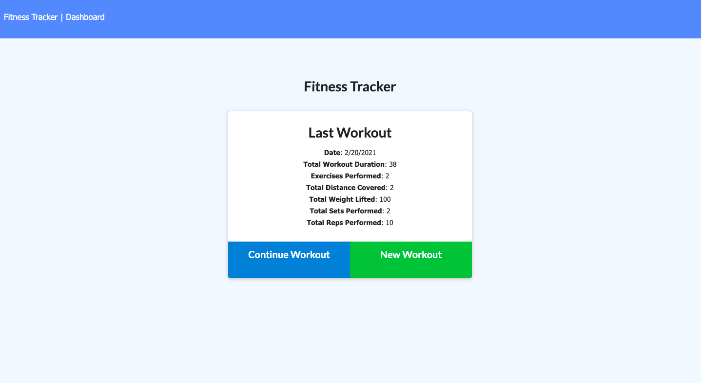
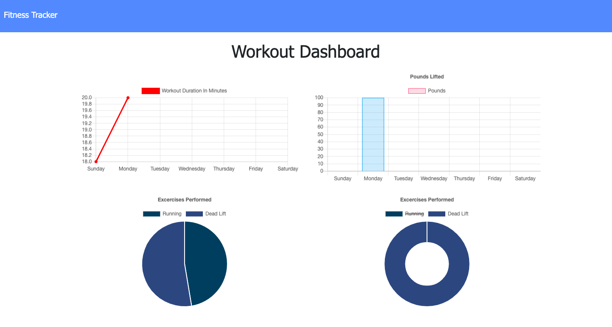
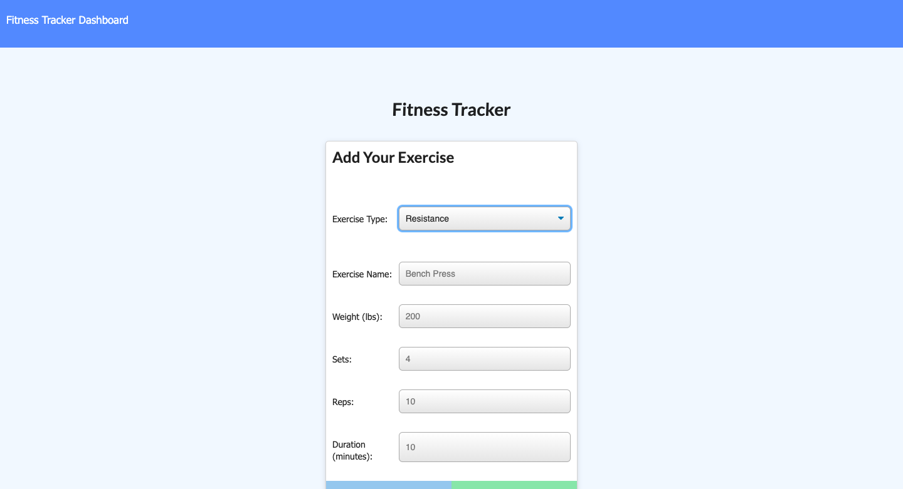

# Fitness Tracker

## About
An app that allows users to add exercises to new or existing workout plans each day.  Daily totals are tracked on the stats page, showing pounds, sets, reps, duration, and distance.  Each exercise is stored in a collection on MongoDB Atlas.  App made with MongoDB, Mongoose, Express, and Node. 

## Screenshots

## Link to Deployed Site
https://track-myfit.herokuapp.com/
